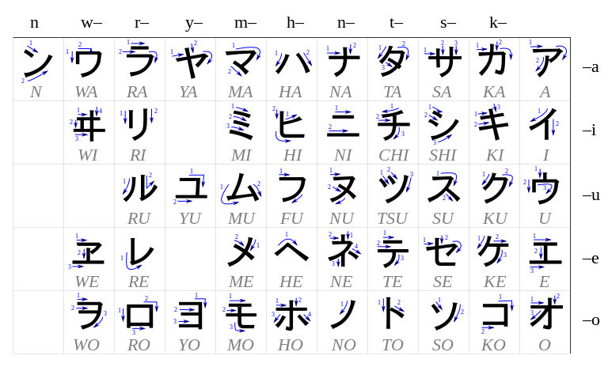

## Kanas Introduction

Les kanas (仮名) sont des caractères de l’écriture japonaise qui notent chacun une more (unité de rythme différente de 
la syllabe). Ils ne sont donc pas similaires aux lettres de l’alphabet latin qui, elles, notent théoriquement des 
phonèmes. Les kanas s’utilisent conjointement aux kanjis (les caractères d'origine chinoise). Ils permettent de noter 
phonétiquement la langue, ce qui n’est pas possible avec les kanjis.

Il existe deux types principaux de kana en japonais moderne :
- les hiragana, pour l'écriture des morphèmes grammaticaux et pour l'écriture (ou la transcription) de certains mots 
japonais
- les katakana, pour la transcription des termes étrangers et d’un grand nombre d’emprunts lexicaux non chinois.

Les kanas peuvent être utilisés pour aider à la lecture de kanji : on les appelle alors furigana.

## Les hiraganas 

## Les katakanas 

